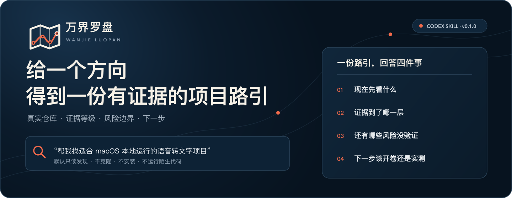

<p align="center">
  
</p>

<p align="center">
  <a href="#60-秒开始"><strong>开始使用</strong></a>
  ·
  <a href="examples/first-success.md">真实样例</a>
  ·
  <a href="#证据不是装饰">证据模型</a>
  ·
  <a href="https://github.com/wuxie888/wanjie-luopan/releases/tag/v0.1.0">v0.1.0</a>
</p>

<p align="center">
  <sub>一个面向 Codex 的开源项目发现与研究 Skill</sub>
</p>

## 60 秒开始

### 安装

```bash
git clone https://github.com/wuxie888/wanjie-luopan.git
mkdir -p "$HOME/.codex/skills/wanjie-luopan"
rsync -a --delete wanjie-luopan/wanjie-luopan/ "$HOME/.codex/skills/wanjie-luopan/"
```

安装后开启一个新的 Codex 任务，让本地 Skill 列表重新加载。

### 第一次调用

```text
使用 $wanjie-luopan 帮我寻找适合 macOS 本地运行、用于研究语音转文字的开源项目。
只做快速发现，不安装运行。
```

你会得到 3–8 个分层候选，以及准确链接、推荐理由、E0–E3 证据等级、主要风险和自然下一步。查看 [真实首次成功样例](examples/first-success.md)。

## 它解决什么

普通搜索擅长返回关键词相似的链接，却不稳定回答：

- 仓库是否真实存在并包含实质代码
- 它是完整应用、开发库、模型、Skill，还是只有演示外壳
- README、源码、社区状态和本地运行分别证明了什么
- 哪些风险会阻止复用或长期使用
- 现在最值得打开哪几个，以及下一步查什么

万界罗盘先过相关性、代码实质、许可证、核心依赖和事实冲突等硬门槛，再对通过门槛的候选排序。Star 只表示热度，不是质量、成熟度或用户量证明。

## 工作方式

| 模式 | 用户任务 | 万界罗盘完成什么 | 用户得到什么 |
| --- | --- | --- | --- |
| **路引** | 给一个模糊方向找项目 | 扩展查询、发现、去重并过硬门槛 | 3–8 个值得看的分层候选 |
| **星图** | 比较多个仓库 | 统一证据口径并解释项目关系 | 不同用途下的优先级与差异 |
| **开卷** | 完整研究一个仓库 | 检查源码、入口、依赖、测试、Issues、Release 与许可证 | 已验证事实、主要风险和使用判断 |
| **最小运行验证** | 明确要求安装或运行 | 只对最终 1–2 个候选执行隔离的核心工作流 | 准确命令、结果、失败项与恢复方法 |

用户只说“找项目”时，默认停在路引，不自动克隆、安装或运行陌生代码。

## 证据不是装饰

| 等级 | 证据 | 可以说明什么 |
| --- | --- | --- |
| **E0 线索** | 搜索摘要、社交帖子、榜单或他人转述 | 发现了一个候选 |
| **E1 仓库表面** | 真实仓库、README、文件树、License、提交或 Release | 仓库当前公开展示了什么 |
| **E2 工程证据** | 入口、依赖、关键源码、测试、Issues 或构建配置 | 代码实际实现了什么 |
| **E3 运行证据** | 在明确环境执行安装、测试或核心工作流 | 本次环境实际跑通了什么 |

证据冲突时，保留冲突本身，不替作者补解释，也不把“能安装”自动写成“适合长期使用”。

## 常见用法

```text
使用 $wanjie-luopan 帮我找一批值得看的本地 AI 项目

使用 $wanjie-luopan 比较这几个 GitHub 仓库，统一证据口径

使用 $wanjie-luopan 完整看下这个项目值不值得用

使用 $wanjie-luopan 把最终两个候选跑一下最小工作流
```

## 当前真实状态

已经实现：

- Codex Skill 内核和固定报告结构
- 路引、基础星图、开卷与按需运行验证规则
- E0–E3 证据模型、硬门槛和许可证边界
- 仅依赖 Python 标准库的确定性评分脚本
- 4 项评分器回归测试
- 一次语音转文字主题的独立前向测试

尚未实现：

- **巡天**：持续扫描新项目与重新活跃项目
- **星历**：持续跟踪提交、Release 与 Issue 变化
- **藏卷**：跨任务个人收藏与研究库
- **舆图**：持久化的项目关系和知识底座
- 独立 App、网站、账号、云端数据服务或自动部署

首个版本化发布为 [`v0.1.0`](https://github.com/wuxie888/wanjie-luopan/releases/tag/v0.1.0)。

## 安装、更新与排错

- 完整安装、首次调用、更新和卸载：[上手指南](docs/GETTING_STARTED.md)
- Skill 未出现、目录嵌套、结果时效性和评分脚本问题：[排错指南](docs/TROUBLESHOOTING.md)

万界罗盘不绑定某个浏览器或 GitHub 连接器，会根据当前环境选择可验证的官方页面、API、项目文档和本地工具。当前环境无法访问来源时，它应该明确说明受阻范围，而不是用旧记忆冒充当前事实。

## 验证

```bash
python3 -m unittest discover -s wanjie-luopan/scripts -p 'test_*.py' -v
python3 wanjie-luopan/scripts/score_candidates.py candidates.json --pretty
```

现有测试证明评分器和 Skill 结构可用，不代表所有搜索主题都达到相同质量。真实搜索仍需要检查来源日期、仓库迁移、许可证、依赖和运行环境。

## 仓库结构

```text
wanjie-luopan/
  SKILL.md                 # Skill 入口与行为边界
  agents/openai.yaml       # Codex 展示元数据
  references/              # 发现、证据、许可证、报告与筛选规则
  scripts/                 # 确定性评分器与测试
docs/                      # 安装、第一次成功与排错
examples/                  # 真实输出样例
product-docs/              # 产品定义、决策与验收记录
test-results/              # 历史验证记录
assets/                    # 品牌、Hero 与 Social Preview
```

## 开发与许可证

本项目采用 [MIT License](LICENSE)。评分脚本使用 Python 标准库；品牌矢量资产为本仓库原创并随仓库按 MIT 许可发布。

产品定义与语言体系见 [项目总览](product-docs/00_项目总览.md) 和 [品牌语言系统](product-docs/05_品牌语言系统.md)。版本变化记录在 [CHANGELOG](CHANGELOG.md)。
